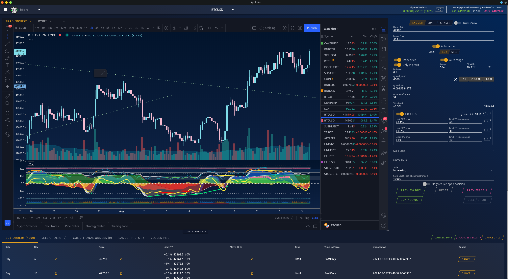
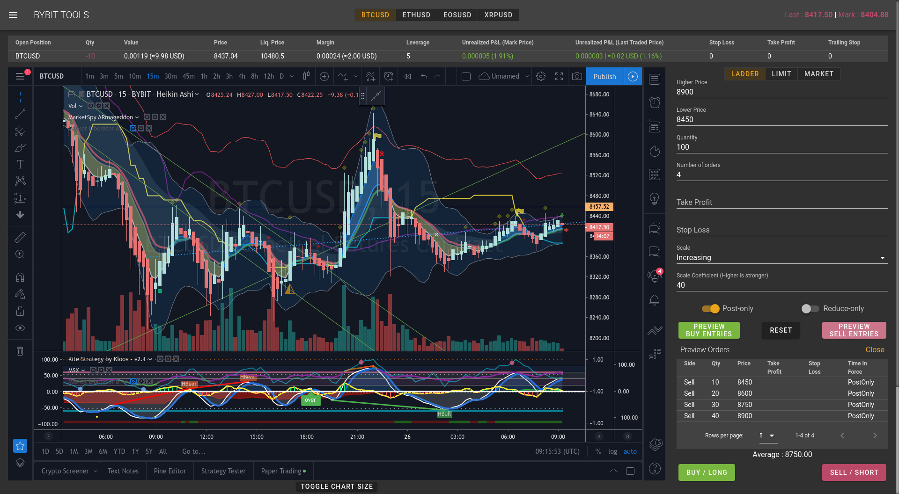
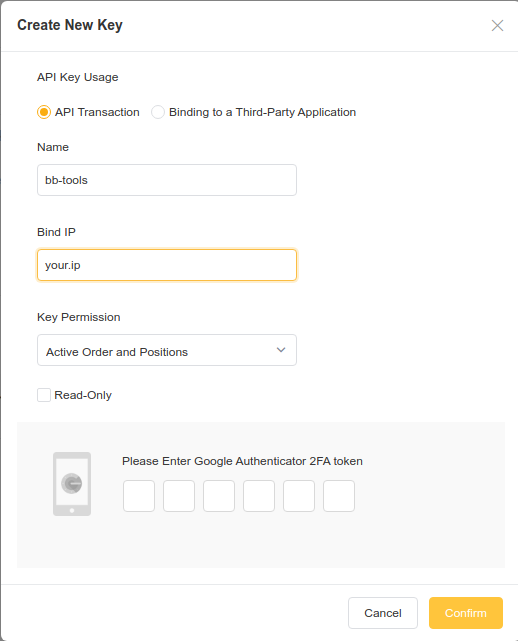

# bybit-tools

Bybit-tools is not maintained anymore

Get Bybit Pro [here](https://bybit-pro.com)



Desktop app to place scaled orders on bybit



##### Features :

 - Including a webview to *your* tradingview chart, allowing you to use custom indicators
 - Generate scaled orders
 - Place laddered/limit/market orders
 - Preview stop loss cost / target profit gains
 - Bulk cancel orders
 - Show current open position
 - Risk management calculator

[Releases](https://github.com/TranceGeniK/bybit-tools/releases)

[Overview and quick how-to by Crypto Ranger](https://www.youtube.com/watch?v=it4fIeX-Gc0)

[Guide en français par Archer](https://www.youtube.com/watch?v=Bl6Q7FZ6iAk&feature=youtu.be)


Bybit API key parameters : 



##### Troubleshooting :
If you're getting `invalid request, please check your timestamp and recv_window param` error, [resync your system clock](https://www.google.com/search?q=sync+system+clock&oq=sync+system+clock)

##### Build instructions :
```
npm install
npm run electron:build
```

##### If you like this app and it's useful to you, please consider supporting my work

BTC Tip line : 1NkgAB4JmbTp7NFkWPVnpZiWJkgoxUkpks

ETH Tip line : 0xedde349177388e3d979223ab6f0d9848ba4b08d8

